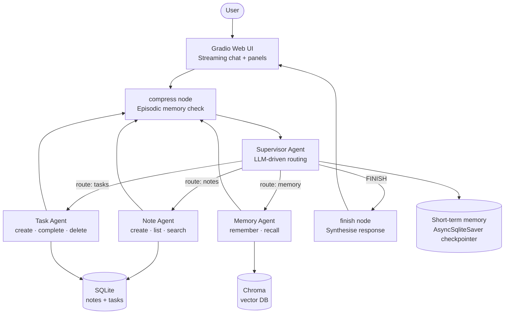

# 🤖 Jarvis — Personal AI Assistant

> A production-grade agentic AI system built in Python, demonstrating tool use,
> multi-tier memory, and multi-agent orchestration — running entirely on your local machine.


---

## What Is This?

Jarvis is a personal AI assistant that manages your **notes and tasks** through natural conversation. It's built as a showcase of core agentic AI engineering patterns — the kind of system you'd build in a production AI team.

```
You:    "Create a task to review the README by Friday, and save a note
         about what we discussed in today's standup."

Jarvis: Done! I've created the task 'Review README' due Friday and saved
        your standup note. Both are ready in the sidebar.
```

Everything runs **locally** — no API keys, no data leaves your machine.

---

## Key Features

- **Multi-agent orchestration** — A supervisor routes tasks to specialist agents (notes, tasks, memory), each with focused toolsets and isolated context
- **Three-tier memory** — Short-term (conversation state), long-term (semantic vector search), and episodic (automatic conversation summarization)
- **Streaming UI** — Token-by-token response streaming in a Gradio web interface with live task and note panels
- **Tool use** — 11 LangChain tools the agent calls at runtime to read/write real data
- **Fully local** — Powered by Ollama (`llama3.2:3b` + `nomic-embed-text`) — no API cost, complete privacy
- **Persistent data** — Notes, tasks, and memories survive restarts via SQLite and Chroma

---

## Architecture



---

## Tech Stack

| Library | Version | Role |
|---------|---------|------|
| **LangGraph** | `>=0.2` | Agent graph framework — stateful nodes, conditional routing, checkpointing |
| **LangChain** | `>=0.3` | Tool abstractions, model wrappers, message types |
| **langchain-ollama** | `>=0.2` | `ChatOllama` and `OllamaEmbeddings` integrations |
| **langchain-chroma** | `>=0.1` | Chroma vector store integration |
| **Chroma** | `>=0.5` | Local vector database for semantic memory |
| **Gradio** | `>=5.0,<6.0` | Web UI with streaming support |
| **aiosqlite** | `>=0.20` | Async SQLite connection used by LangGraph checkpoints |
| **Pydantic** | `>=2.0` | Data validation (required by LangChain v0.3+) |
| **Ollama** | local | Runs `llama3.2:3b` (chat) and `nomic-embed-text` (embeddings) |
| **SQLite** | stdlib | Notes, tasks, conversation checkpoints |

---

## Quick Start

**1. Install prerequisites**

```bash
# Python 3.11+ and uv (modern package manager)
pip install uv

# Ollama — runs models locally
# Download from: https://ollama.com/download
```

**2. Pull the AI models**

```bash
ollama pull llama3.2:3b        # chat model (~2 GB)
ollama pull nomic-embed-text   # embedding model (~270 MB)
```

**3. Clone and install**

```bash
git clone <repo-url>
cd jarvis
make install
```

**4. Verify everything works**

```bash
make health
# ✅ Python 3.11 — OK
# ✅ All dependencies installed
# ✅ Ollama is running
# ✅ llama3.2:3b responded
# ✅ nomic-embed-text available
# 🎉 Jarvis is ready to go!
```

**5. Run Jarvis**

```bash
make run
# → http://localhost:7860
```

**Optional: seed safe mock data**

```bash
python tools/generate_mock_data.py
# → writes 4 tasks and 5 notes to data/mock_jarvis.db
```

The generator is idempotent and does not touch the live `data/jarvis.db` unless
you explicitly pass a different `--db-path`.

---

## Project Structure

```
jarvis/
│
├── agents/
│   ├── assistant.py       # Single ReAct agent — the foundational pattern
│   └── supervisor.py      # Multi-agent supervisor — the production architecture
│
├── db/
│   └── database.py        # SQLite CRUD layer for notes and tasks
│
├── memory/
│   ├── long_term.py       # Chroma vector store + @tool wrappers
│   └── episodic.py        # Conversation summarization and compression
│
├── tools/
│   ├── note_tools.py      # 4 LangChain @tools for note management
│   ├── task_tools.py      # 5 LangChain @tools for task management
│   └── generate_mock_data.py # Safe local demo/test data generator
│
├── ui/
│   ├── app.py             # Gradio Blocks UI with streaming
│   └── assets/
│       └── jarvis-avatar.svg # Assistant avatar used by the chat UI
│
├── tests/
│   ├── test_database.py   # 14 tests — SQLite CRUD
│   ├── test_note_tools.py # 13 tests — note tool functions
│   ├── test_task_tools.py # 16 tests — task tool functions
│   └── test_memory.py     # 18 tests — vector memory (mocked)
│
├── docs/
│   ├── 00-architecture.md # Full system architecture and design decisions
│   ├── 01-setup.md        # Setup guide (JS-developer friendly)
│   ├── 02-database.md     # SQLite layer explained
│   ├── 03-tools.md        # LangChain tools explained
│   ├── 04-agent.md        # ReAct agent and LangGraph explained
│   ├── 05-memory.md       # Three-tier memory system explained
│   ├── 06-multi-agent.md  # Supervisor pattern explained
│   ├── 07-ui.md           # Gradio UI and streaming explained
│   └── 08-episodic-memory.md  # Episodic compression explained
│
├── config.py              # Settings singleton — all env vars with defaults
├── health_check.py        # Pre-flight: verify Ollama + models + dependencies
├── pyproject.toml         # Python package manifest (equivalent to package.json)
├── Makefile               # make install · make run · make test · make health
└── .env.example           # Documented environment variables
```

---

## How It Works

```
1. You type a message in the Gradio chat UI

2. The supervisor graph receives it — first checks if conversation
   needs episodic compression (>20 messages → summarise + store in Chroma)

3. The supervisor LLM reads the conversation and decides:
   which specialist agent should handle this request?

4. The chosen specialist (note/task/memory agent) runs its own
   internal ReAct loop: reason → call tool → observe result → respond

5. The specialist's result flows back to the supervisor

6. The supervisor decides: more work needed, or FINISH?

7. The finish node synthesises a clean, friendly response

8. Tokens stream to your browser one by one as they're generated

9. The sidebar panels refresh showing updated tasks and notes
```

---

## What This Demonstrates

This project is built to showcase the following skills to a technical interviewer:

| Skill | Where demonstrated |
|-------|-------------------|
| **LangGraph stateful graphs** | `agents/assistant.py`, `agents/supervisor.py` — TypedDict state, nodes, conditional edges |
| **ReAct agent loop** | `agents/assistant.py` — Reason + Act cycle with tool calling |
| **Multi-agent orchestration** | `agents/supervisor.py` — Supervisor routes to specialists, each with isolated toolsets |
| **LangChain tool use** | `tools/note_tools.py`, `tools/task_tools.py` — `@tool` decorator, docstring-as-description |
| **RAG / semantic memory** | `memory/long_term.py` — Chroma + OllamaEmbeddings, similarity search |
| **Episodic memory** | `memory/episodic.py` — Automatic summarization + storage to vector DB |
| **Async Python** | `agents/`, `ui/app.py` — `async def`, `await`, `async for`, async generators |
| **Streaming responses** | `ui/app.py` — `astream_events` with `version="v2"`, token-by-token yield |
| **Local AI (Ollama)** | `config.py`, entire stack — no API keys, runs on CPU |
| **SQLite persistence** | `db/database.py` — raw SQL, parameterised queries, UUID primary keys |
| **pytest testing** | `tests/` — fixtures, `patch.object`, in-memory DB, MagicMock |
| **Python packaging** | `pyproject.toml`, `uv`, `pyproject.toml` extras |

---

## Makefile Reference

```bash
make install   # Install all Python dependencies
make health    # Verify Ollama + models + dependencies are ready
make run       # Start the Gradio web UI at http://localhost:7860
make test      # Run all tests with pytest
make clean     # Remove data/ and cache files (⚠️ deletes notes/tasks/memories)
make help      # Show all available commands
```

---

## Configuration

Copy `.env.example` to `.env` and edit as needed:

```bash
cp .env.example .env
```

| Variable | Default | Description |
|----------|---------|-------------|
| `OLLAMA_BASE_URL` | `http://localhost:11434` | Ollama server URL |
| `MODEL_NAME` | `llama3.2:3b` | Chat model (must be pulled with `ollama pull`) |
| `EMBED_MODEL` | `nomic-embed-text` | Embedding model for vector memory |
| `DB_PATH` | `./data/jarvis.db` | SQLite database file path |
| `CHROMA_PATH` | `./data/chroma_db` | Chroma vector store directory |
| `COMPRESSION_THRESHOLD` | `20` | Messages before episodic compression fires |

---

## Documentation

Each component has a detailed doc in `docs/` explaining the concepts, code patterns, and how everything connects — written for a JS developer learning Python AI engineering:

- [00 — Architecture](docs/00-architecture.md) — Full system diagram and design decisions
- [01 — Setup](docs/01-setup.md) — Installation guide with JS/Python comparisons
- [02 — Database](docs/02-database.md) — SQLite layer, schema, testing patterns
- [03 — Tools](docs/03-tools.md) — LangChain `@tool`, docstrings, tool groups
- [04 — ReAct Agent](docs/04-agent.md) — LangGraph graphs, state, ReAct loop
- [05 — Memory](docs/05-memory.md) — Three-tier memory, embeddings, Chroma
- [06 — Multi-Agent](docs/06-multi-agent.md) — Supervisor pattern, routing, specialists
- [07 — UI](docs/07-ui.md) — Gradio Blocks, streaming, `gr.State`
- [08 — Episodic Memory](docs/08-episodic-memory.md) — Compression, summarization, memory timeline

---

## Running the CLI (without UI)

```bash
# Single agent CLI
python agents/assistant.py

# Multi-agent supervisor CLI
python agents/supervisor.py

# With a named session (persists across restarts)
python agents/supervisor.py my-session
```

---

## License

MIT — free to use, modify, and include in your portfolio.
